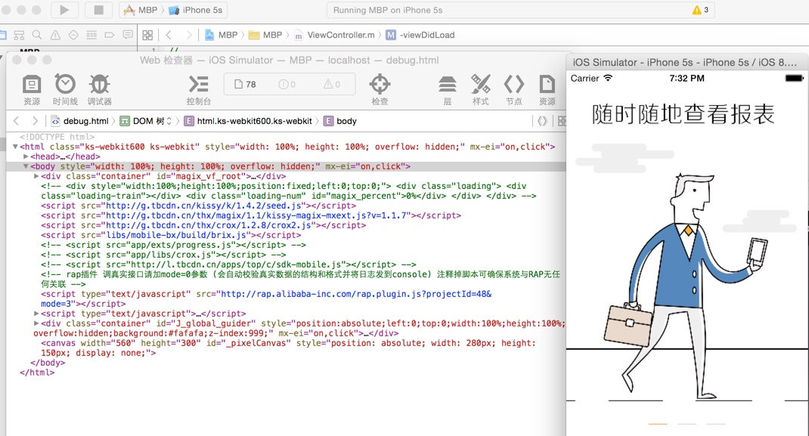
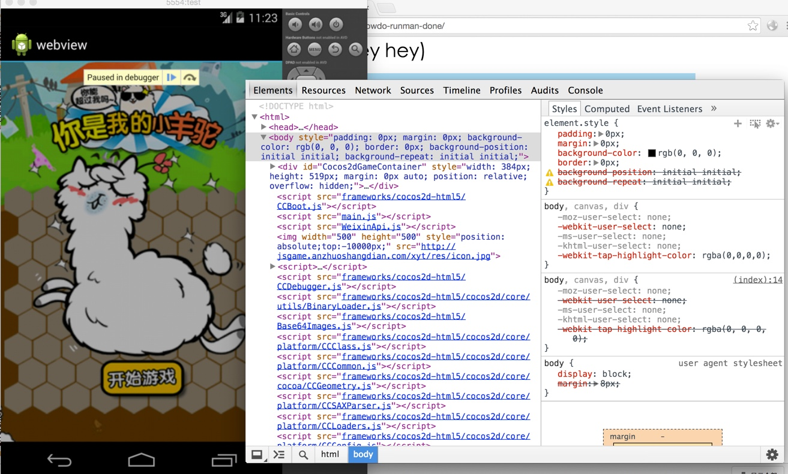

# 无线端使用仿真器调试

## 优缺点
   - 优点：用电脑就可以调试任何版本的sdk和手机，对于缺少真机 或者真机无法安装对应sdk的时候使用方便
   - 缺点：需要搭建环境 ADT还有XCODE运行环境，webview的程序可能会根据版本不同而调整
## IOS
  - 解压缩ios-webview.zip
  - 使用Xcode打开工程
  - 修改 ViewController.m文件 
    - NSURLRequest *request =[NSURLRequest requestWithURL:[NSURL URLWithString:@"http://xx.html"]];//xx将为要调试的html名称
  - 运行即可在仿真器显示应用
  - 打开safari，在safari菜单》开发》iphone simulator 就可以利用safari在里面调试webview中h5的代码
     

     

## Android

- 解压缩android-webview.zip
- 工程导入到eclipse ADT中
- 下载不同的androidsdk版本运行（webview根据版本的不同可能需要调整）
- 启动AVD运行程序，程序会让你首先输入要测试的网址 输入后点击 click me 进入调试的页面
- 使用Chrome的远程即可调试 chrome://inspect/#devices(选择对应的inspect后如果 长时间空白 需要翻墙)

